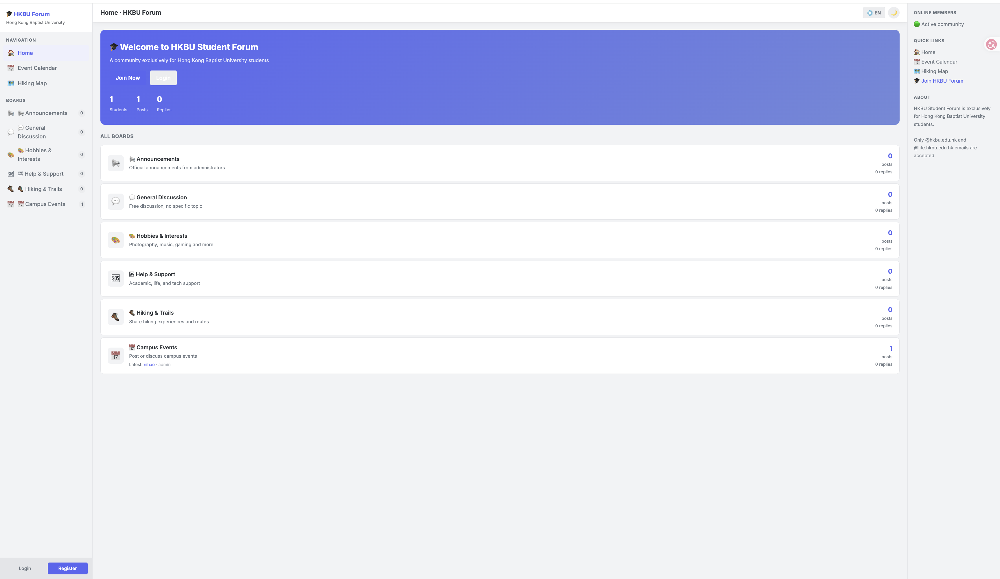
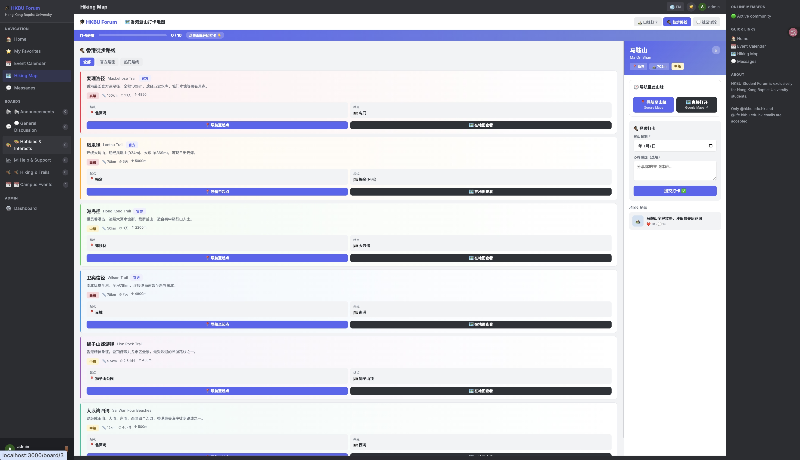
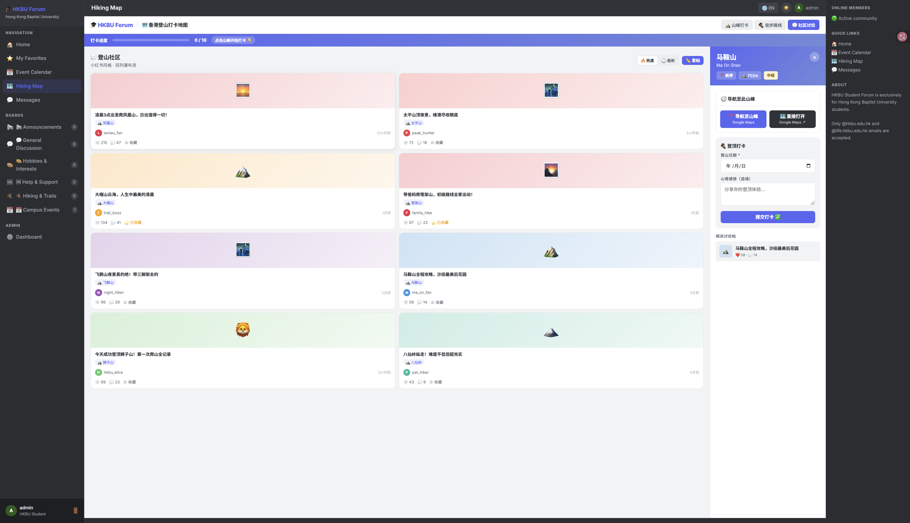

# 🧑‍💻 HKBU Forum – Outdoor Community Platform

A web-based **community forum and outdoor activity platform** built with **Node.js, Express, and SQLite**.

The system combines a **discussion forum**, **hiking exploration tools**, and an **event calendar** into a single platform designed for university students to share outdoor experiences and organize activities.

This project demonstrates **full-stack web development**, including backend APIs, database integration, server-side rendering, and interactive map features.

---

# 📸 Screenshots

## 🌗 Light Mode / Dark Mode

The platform supports both **light mode and dark mode** for better user experience.

---

## 🏠 Forum Homepage

Community homepage with multiple discussion boards.

Users can browse topics, create posts, and participate in discussions.

---

## ✏️ Create New Post

Users can create discussion posts and optionally add events to the calendar.

---

## 🥾 Hiking Map

Interactive hiking map built using **Leaflet + OpenStreetMap**.

Users can explore hiking locations across Hong Kong.

---

## 📍 Hiking Checkpoints & Google Maps Navigation

Each hiking location includes:

- Hiking checkpoint system
- Navigation to trail starting point
- Google Maps integration for route navigation

---

## 🗺 Hiking Route Explorer

Users can explore official hiking trails such as:

- MacLehose Trail
- Lantau Trail
- Hong Kong Trail
- Wilson Trail

Each trail includes route information and navigation support.

---

## 🏔 Hiking Community Posts

Users can share hiking experiences and interact with the community.

---

## 📅 Event Calendar

Community event calendar where users can organize activities.

Features include:

- Monthly calendar view
- Event publishing
- Export events to **ICS calendar format**

Users can import events into:

- Apple Calendar
- Google Calendar
- Outlook

---

# 📌 Key Features

## 🧑‍🤝‍🧑 Community Forum

- User registration and login
- Create and manage discussion posts
- Reply to posts
- Multiple discussion boards
- Admin management system

---

## 🥾 Hiking Exploration System

- Interactive hiking map
- Hiking checkpoint tracking
- Google Maps navigation integration
- Hiking route explorer
- Community hiking posts

---

## 📅 Activity Calendar

- Event publishing
- Monthly calendar view
- Export to ICS calendar format
- Integration with device calendars

---

## 💬 Private Messaging (Planned)

Future versions will include a **private messaging system** allowing users to communicate directly within the platform.

---

# 🏗 Tech Stack

## Backend

- Node.js
- Express.js

## Frontend

- HTML
- CSS
- JavaScript
- EJS Template Engine

## Database

- SQLite

## Map Technology

- Leaflet.js
- OpenStreetMap
- Google Maps Navigation

## Development Tools

- Git
- GitHub

---

# 📂 Project Structure

bu-forum-system
│
├── public/ # Static assets (CSS, JS, maps)
├── routes/ # Express routes
├── views/ # EJS templates
│
├── db.js # Database connection
├── server.js # Main server
├── i18n.js # Internationalization support
├── package.json # Dependencies
└── setup.sh # Setup script

---

# 🚀 Getting Started

### 1 Clone repository

git clone https://github.com/Wilson-M-A/bu-forum-system.git

### 2 Enter project directory

cd bu-forum-system

### 3 Install dependencies

npm install

### 4 Run server

node server.js

### 5 Open in browser

http://localhost:3000

---

# 🧪 Example Use Cases

Users can:

- Discuss hiking routes in community forums
- Share hiking experiences
- Explore hiking trails on the interactive map
- Navigate to hiking locations via Google Maps
- Organize outdoor activities through the event calendar
- Export events to personal calendars

---

# 🔮 Future Improvements

- 🤖 AI-powered post summarization
- 🤖 AI reply suggestions
- 👤 User profile system
- 💬 Private messaging system
- 🔎 Smart search
- ☁️ Cloud deployment
- 📱 Improved mobile UI

---

# 🌍 Deployment (Future)

The platform can be deployed using:

- Render
- Railway
- Vercel

---

# 👨‍💻 Author

**Mingyang Ma**

Computer Science Student  
Hong Kong Baptist University

GitHub  
https://github.com/Wilson-M-A

---

⭐ If you like this project, feel free to give it a **star ⭐ on GitHub**.
